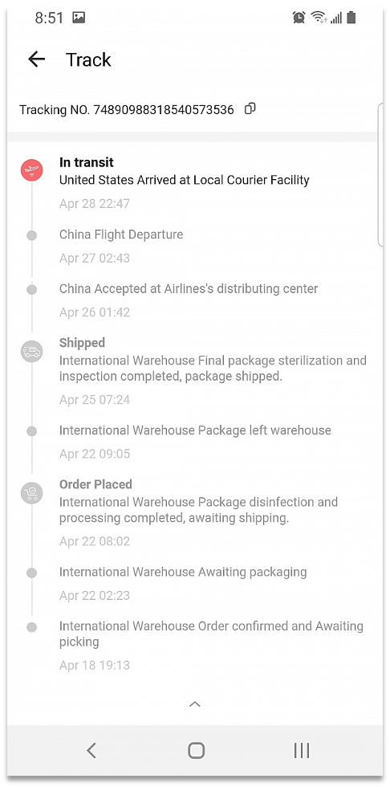
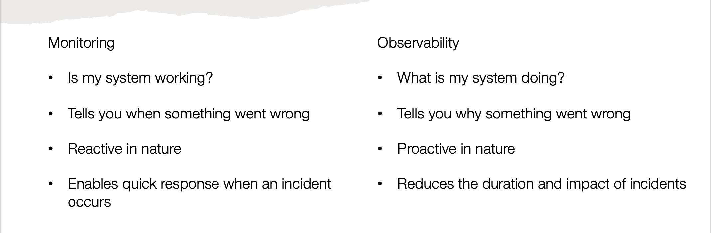
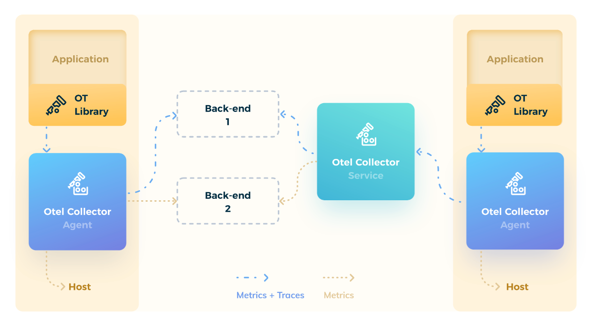
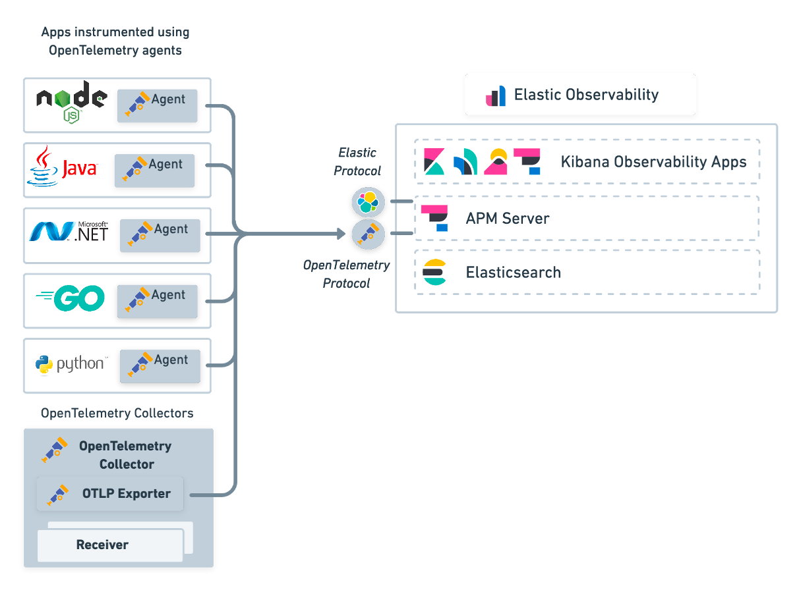

# About OTel

## Analogy

**Where is the shipment?**

To answer this question, you need to know the tracking number. 
Once a unique tracking number is available, the systems on the supply chain start to collate shipment specific information.

> @TODO: Introduce need for a observability from different perspective (shipper/customer)

---

## MOnitoring vs Observability 

> @TODO: This section conveys that Telemetry aids in Observability.
> It helps in finding the underlying truth

---

## What is Telemetry?

* Tracing 
* Metrics
* Logs

### What is a Trace ?

### Metrics

### Logs

---

## OpenTelemetry in a nutshell

* OpenTelemetry is a collection of tools, APIs, and SDKs. Used to determine the root cause of an issue
* Broad support for multiple languages and framework 
* 100% Free and Open Source, OpenTelemetry is adopted and supported by industry leaders in the observability space.

> @TODO: Need to elaborate here

### Architechture in Greenfield implementations

### Architechture in brownfield implementation

--- 

## A demo - Let us get our hands dirty

> @TODO: Add a link to companion blogpost for demo

---

## Conclustion

---

## References

https://opentelemetry.io/
https://opensourcelive.withgoogle.com/events/opentelemetry-day-2022