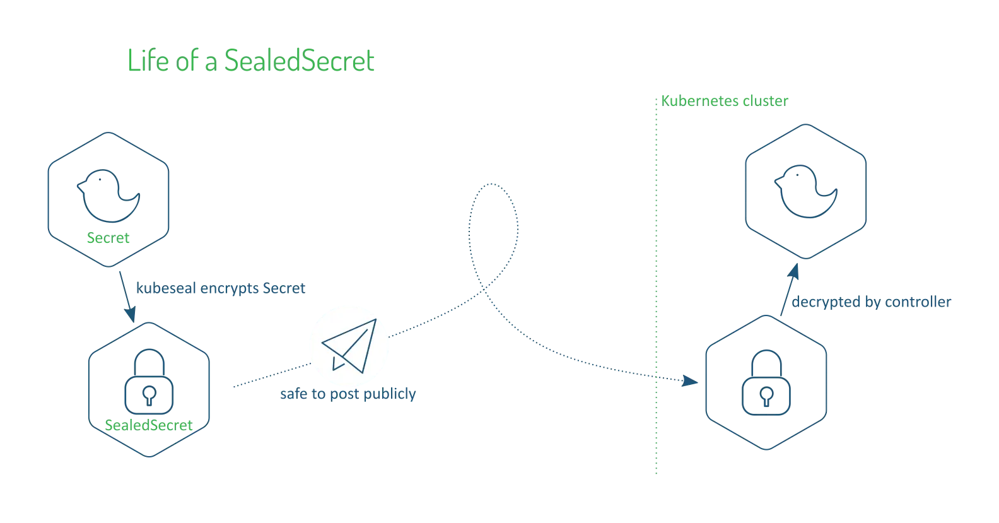

# Sealed secrets

Sealed secrets is an opensource Kubernetes controller and tool for generating **one-way encrypted Secrets** [asymmetric (public key) cryptography]. 

It was originally relseased five years ago by Bitnami and has since been the go-to tool for securely managing secrets in Kubernetes ecosystem. 


---

## Little more insight into Sealed Secrets




```
Sealed Secrets are a "one-way" encrypted Secret that can be created by anyone, but can only be decrypted by the controller running in the target cluster. 

The Sealed Secret is safe to share publicly, upload to git repositories, post to twitter, etc. 

Once the SealedSecret is safely uploaded to the target Kubernetes cluster, the sealed secrets controller will decrypt it and recover the original Secret.

- Bitnami
```

---

## Why to use Sealed Secrets ?

```
Kubernetes natively supports a key-value object known as a secret. However, by default, Kubernetes **secrets aren't really secret.** 

Secrets in Kubernetes are handled separately from other key-value data so that precautions or access control can be applied separately. 

There is support for encrypting secrets before they are stored in etcd, but the secrets start out as plain text fields in configuration files. 

Sealed Secrets is a combination operator and command-line utility that uses asymmetric keys to encrypt secrets so that they can only be decrypted by the controller in the cluster. This process ensures that the secrets won't be compromised while they sit in the configuration files that define a Kubernetes deployment. Once encrypted, these files can be safely shared or stored alongside other deployment artifacts.

- Thoughtworks tech radar

```

---

## Two components in Sealed Secrets

The SealedSecrets implementation consists of two components:
* A controller that runs in-cluster, and implements a new SealedSecret Kubernetes API object via the "third party resource" mechanism.

* A kubeseal command line tool that encrypts a regular Kubernetes Secret object (as YAML or JSON) into a SealedSecret.

---

## A bit more technical insights on how Sealed Secrets operate

```
Step 1: Generating key pairs
The first step involves using the controller component in Kubernets cluster to generate a public/private RSA key pair and persist it in a regular Kubernetes Secret.

The controller publishes the public key to its log and over HTTP at /v1/cert.pem.

> NOTE: The public key is not secret, although you do need to ensure you are using the correct public key. 

Step 2: Encrypting secret
RSA can only encrypt small amounts of data, so SealedSecrets use a typical two-stage combination of symmetric and asymmetric encryption.

To encrypt, kubeseal JSON-encodes the Secret, and symmetrically encrypts it using AES-GCM with a randomly-generated single-use session key. 

The session key is then asymmetrically encrypted with the controller's public key using RSA-OAEP, and the original Secret's namespace/name as the OAEP input parameter (aka label). The final output is: 2 byte encrypted session key length || encrypted session key || encrypted Secret.

Step 3: Decryption
During decryption, the SealedSecret controller uses the namespace/name from the SealedSecret as the OAEP input parameter, ensuring that the SealedSecret and Secret are tied to the same namespace and name. 

It then performs the reverse steps: Use the controller's private key to decrypt the single-use session key, then use the session key to decrypt the JSON-encoded Secret. Finally, the Secret is created under the namespace/name of the SealedSecret, again enforcing this fixed relationship.

- [Bitnami](https://docs.bitnami.com/tutorials/sealed-secrets)
```

---

## Ready to try it out? 

TBD


---

## More details and notes 

```
SealedSecrets and the kubeseal tool are designed to easily fit into automated workflows. Once converted into a SealedSecret, not even the original user will be able to retrieve the original Secret. kubeseal can also be run offline, without access to the cluster - it just needs a copy of the public key available on disk somewhere.

These features allow low-privileged automated tasks to generate new random secrets and feed them into a change management workflow without requiring any elevated access to existing secrets. Using this it is possible to set up workflows that encourage frequent rotation and replacement of secrets rather than managing additional backup copies of plain-text secrets.

It is important to be aware that SealedSecrets do not authenticate the user, by design. This means that any user with a copy of the right public key is able to create an offline SealedSecret for your cluster, but it is up to your regular change management processes, cluster RBAC rules, etc to make sure that only the intended SealedSecret makes it to your cluster. SealedSecrets are intentionally no different to all your other cluster configuration in this regard.

    * The k8s 1.7 feature protects you if someone steals the hard disk from one of your etcd servers.

    * SealedSecrets protects you during all the workflow stages before that.

-- Bitnami documentation (https://docs.bitnami.com/tutorials/sealed-secrets)


```

---

## Refrences

https://docs.bitnami.com/tutorials/sealed-secrets

https://www.thoughtworks.com/radar/platforms/sealed-secrets

https://github.com/bitnami-labs/sealed-secrets

https://www.cncf.io/blog/2022/01/25/secrets-management-essential-when-using-kubernetes/

https://medium.com/@udhanisuranga/how-to-use-sealed-secrets-in-kubernetes-af526088d67 