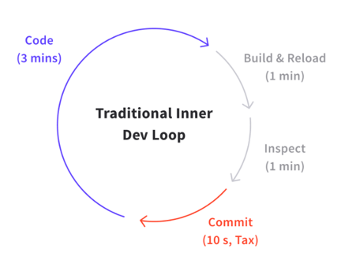
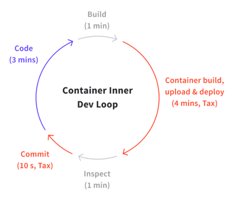
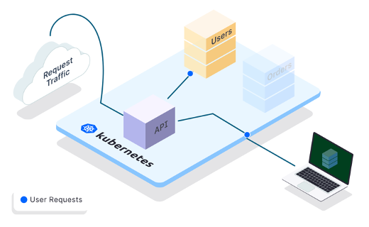

## Challenges and Pain points while developing distributed applications

Moving to a Cloud-native, microservice-based distributed system architecture means adopting new development and delivery workflow.

One tangible impact in developing distributed systems is the inherent slowing down of the development process and change in developer experience.

The makers of Telepresence estimate that there is a _"40% decrease in potential new features being released."_ Not to mention resolving various kinks and complexities before seeing any returns in terms of efficiency and resiliency.

What is that extra effort then spent on? 
[Telepresence.io](https://www.telepresence.io/docs/latest/concepts/devloop/) quantifies the extra effort(tax) in terms of time spent towards:
* Packaging code in containers
* Preparing manifest files to configure Kubernetes/Openshift
* Pushing containers to registry
* Finally deploying them to the cluster

The side effect is not just limited to putting extra effort towards deploying artifacts onto the cluster. There is one more: **Debugging and maintaining** distributed software applications.

For effectively debugging distributed applications, developers hack their way to replicate issues by building mock/stub services. Over time, the complexity of maintaining a distributed application effectively becomes a game of hot and cold. 

**Now that is where [Telepresence](https://www.telepresence.io) comes in!**

---

## What is Telepresence?

Telepresence is a Cloud Native Computing Foundation **sandbox** project currently under active development. As of this writing, it is on version 2.5.5

It is an open-source, lightweight tool that lets you run services locally while allowing you to connect to a service on a remote Kubernetes based cluster like so: 

---

## How does Telepresence work?

### Context propogation
The technique of Context Propagation, a cornerstone for distributed tracing/APM tools, plays a crucial role in enabling Intercepts/Preview URLs features in Telepresence. 

It involves transferring request metadata (like HTTP headers, injected headers) across services within the system.

Using the information in the headers (context), Telepresence can effectively identify which traffic to intercept and route it across services.

> **Side Note:** What is context propagation?
_The ability to correlate events across service boundaries is one of the principal concepts behind distributed tracing. To find these correlations, components in a distributed system need to collect, store, and transfer metadata referred to as context. Propagation is how context is bundled and transferred across services, often via HTTP headers._

### Intercepts

Telepresence deploys a two-way network proxy on a pod running in a Kubernetes cluster to enable intercepts.

The pod then proxies data from the Kubernetes environment (e.g., TCP connections, environment variables, volumes) to the local process, creating an intercept. 

This proxy can then intercept traffic meant for the service and reroute it to a local copy, ready for further (local) development.

> For more information on Context propogation and Intercepts, please refer to the detailed documentaion maintained by the opensource community: [Context propogation](https://www.telepresence.io/docs/latest/concepts/context-prop/), [Intercepts](https://www.telepresence.io/docs/latest/reference/intercepts)

---

## Use cases for Telepresence? 

### Debugging remote service using Intercepts 
Telepresence enables developers to create intercepts to a target Kubernetes workload. Once an intercept is up, developers can code and debug the associated service locally.

This ability allows developers to revert to the lifecycle where more time is devoted to development. 

### Internal A/B testing & Demostration
Telepresence can generate sharable PreviewURLs. These preview URLs enable developers to work on a copy of the service locally and share that environment with a teammate for pair programming.

While using Preview URLs, Telepresence will route only the requests coming from that preview URL to your local environment. Requests to the ingress are routed to your cluster as usual.

> **There is a caveat here:** For PreviewURL to work, you have to leverage services offered by [Ambassador](https://app.getambassador.io/) to create/secure PreviewURLs. While the service is effective, air-gapped systems will not be able to leverage it. 

---

## Alternatives

The closest alternative to Telepresence I could find is:
[Gefyra](https://gefyra.dev/)/[Unikube](https://unikube.io/) 

As per the documentation, these alternatives promise to improve the developer experience and development lifecycle on Kubernetes-based infrastructure. 

We will do a full review of Gefyra/Unikube and report back to you.

---

## Telepresence demo

I hope this post convinced you about the benefits of Telepresence as a tool to improve the development and delivery workflow of large microservice-based distributed applications. 

To get a better understanding, feel free to read through the companion post that walks you through the steps involved in [setting up and Telepresence and intercept microservices on a Kubernetes cluster.](https://medium.com/@backin200ms/using-telepresence-to-intercept-microservices-on-a-kubernetes-cluster-ebaa0691fc0f)

---

## References

### Telepresence 
https://www.telepresence.io/
https://www.getambassador.io/products/telepresence/

### Alternative to Telepresence
https://thenewstack.io/kubernetes-infrastructure-know-the-inner-dev-loop/

Gefyra
https://gefyra.dev/

Unikube
https://unikube.io/

### Open telemetry
https://opentelemetry.lightstep.com/core-concepts/context-propagation/
https://www.weave.works/blog/debugging-microservices-squash-vs-telepresence