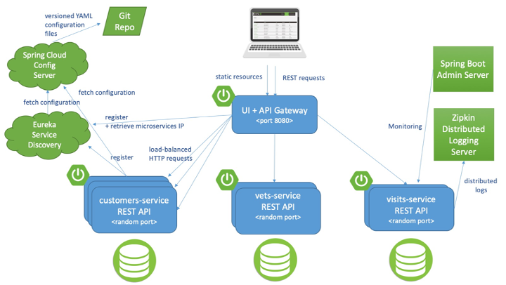
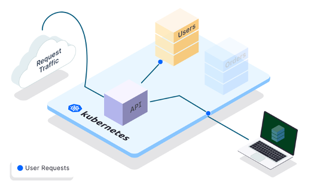

# Using Telepresence to intercept microservice


In this demonstration, we will be intercepting a Spring-boot microservice-based application deployed onto a Kubernetes cluster. 

The traffic to a service (on a k8s cluster) will be intercepted and redirected to a corresponding service running in a local development environment. 

This post helps demonstrate a usecase that allows developers to debug a microservice service locally without building and deploying it onto the cluster.

> **NOTE:** The code for this demo has been adapted from the distributed version of the [Spring PetClinic for Cloud Foundry and Kubernetes.](https://github.com/spring-petclinic/spring-petclinic-cloud)




## Set up k8s cluster

You may choose to set up or use a cluster in the cloud environment if you have access to it. 

I will use a local Kubernetes cluster created using [KinD](https://kind.sigs.k8s.io/).
Please refer to the [KinD Quick start guide](https://kind.sigs.k8s.io/docs/user/quick-start/) to install the necessary software. 

``` sh
# Creating a Kubernetes cluster using KinD is as simple as:
$ kind create cluster --name kind2pet

Creating cluster "kind2pet" ...
 ✓ Ensuring node image (kindest/node:v1.23.4) 🖼
 ✓ Preparing nodes 📦
 ✓ Writing configuration 📜
 ✓ Starting control-plane 🕹️
 ✓ Installing CNI 🔌
 ✓ Installing StorageClass 💾
Set kubectl context to "kind-kind2pet"


```

## Choose docker registry

Now that the cluster is up, the next step is to prepare images for deploying onto the Kubernetes cluster.

Let us begin by setting up an environment variable to target your Docker registry. For Docker hub, provide your username as follows on the terminal.

```
$ export REPOSITORY_PREFIX=<your_docker_username>
```

If you're targeting the Docker hub, make sure you have logged into docker. If you have not logged in before, you will be prompted to log in. 

```
$ docker login

Authenticating with existing credentials...
Login Succeeded
```

It is time to build all images and push them to your registry. To start this, run:

```sh 
$ git clone https://github.com/spring-petclinic/spring-petclinic-cloud

$ cd spring-petclinic-cloud

$ mvn spring-boot:build-image -Pk8s -DREPOSITORY_PREFIX=${REPOSITORY_PREFIX} && ./scripts/pushImages.sh
```

> NOTE: The demo uses code from https://github.com/spring-petclinic/spring-petclinic-cloud. You can find more documentation and details to set up this application on CloudFoundary and more. 

## Configure objects in Kubernetes cluster

In the previous step, we built container images. We will be configuring the cluster to host these images at this stage. 

```sh

# Create a new namespace `spring-petclinic` by running:
$ kubectl apply -f k8s/init-namespace/

namespace/spring-petclinic created

# With namespace defined, we will follow up by creating various Kubernetes services that will be used later on by our deployments:

$ kubectl apply -f k8s/init-services

configmap/petclinic-config created
role.rbac.authorization.k8s.io/namespace-reader created
rolebinding.rbac.authorization.k8s.io/namespace-reader-binding created
deployment.apps/wavefront-proxy created
service/wavefront-proxy created
service/api-gateway created
service/customers-service created
service/vets-service created
service/visits-service created

# Run the below commands to check if the service and pods are up and running. 

$ kubectl get svc -n spring-petclinic

$ kubectl get pods -n spring-petclinic

```

## Install DB in the cluster

At this stage, we set up MySQL DB that the microservices in the pet-clinic application are configured to use.

```sh
$ helm repo add bitnami https://charts.bitnami.com/bitnami

$ helm repo update

$ helm install vets-db-mysql bitnami/mysql --namespace spring-petclinic --version 8.8.8 --set auth.database=service_instance_db

$ helm install visits-db-mysql bitnami/mysql --namespace spring-petclinic  --version 8.8.8 --set auth.database=service_instance_db

$ helm install customers-db-mysql bitnami/mysql --namespace spring-petclinic  --version 8.8.8 --set auth.database=service_instance_db
```

## Deploy to k8s cluster

We are almost there!
Now that the cluster environment is all set and ready, we will deploy the application onto the cluster.

To get the application up and running, execute:

```
$ ./scripts/deployToKubernetes.sh

deployment.apps/api-gateway created
deployment.apps/customers-service created
deployment.apps/vets-service created
deployment.apps/visits-service created

```

Wait for the pods and services to come up before accessing the application using the following commands:

```sh
$ kubectl get pods -n spring-petclinic

NAME                                READY   STATUS                       RESTARTS   AGE
api-gateway-758b55bd45-pzr2q        1/1     Running                      0          2m2s
customers-db-mysql-0                1/1     Running                      0          2m19s
customers-service-68df4cdd8-7j6d9   1/1     Running                      0          2m2s
vets-db-mysql-0                     1/1     Running                      0          2m27s
vets-service-7846bc6796-p5b25       1/1     Running                      0          2m2s
visits-db-mysql-0                   1/1     Running                      0          2m23s
visits-service-6479f649f6-7gtb7     1/1     Running                      0          2m2s
wavefront-proxy-7c4d99c8d8-nzpk9    0/1     CreateContainerConfigError   0          4m13s

# NOTE: it is okay if wavefront is not up. We are not using it for this demo. 

$ kubectl get svc -n spring-petclinic api-gateway

NAME          TYPE           CLUSTER-IP      EXTERNAL-IP   PORT(S)        AGE
api-gateway   LoadBalancer   *.*.*.*         <pending>     80:31591/TCP   5m2s

```

Once the services are up and running, the Spring-Petclinic cannot yet be accessed. 

> Why?! We have not configured any ingress service cluster. Instead, we will use Telepresence to configure the networking services to access the application.

## Intercept using Telepresence

Now it is time to intercept the `vets-service` and `customers-service` on the cluster and redirect them to specific ports on your localhost. 

> NOTE: To install Telepresence, please refer to latest installation instructions on https://www.telepresence.io/



```sh
# Connect to the remote cluster from the localhost.
$ telepresence connect

Connected to context kind-kind2pet (https://127.0.0.1:63040)

# This command lists the interceptable services on the cluster with in the spring-petclinic namespace
$ telepresence list --namespace spring-petclinic

api-gateway       : ready to intercept (traffic-agent not yet installed)
customers-db-mysql: ready to intercept (traffic-agent not yet installed)
customers-service : ready to intercept (traffic-agent not yet installed)
vets-db-mysql     : ready to intercept (traffic-agent not yet installed)
vets-service      : ready to intercept (traffic-agent not yet installed)
visits-db-mysql   : ready to intercept (traffic-agent not yet installed)
visits-service    : ready to intercept (traffic-agent not yet installed)
wavefront-proxy   : ready to intercept (traffic-agent not yet installed)

# The following two command installs the necessary Telepresence agents on the remote target service. It takes a few seconds to install. 
# Once intercepted, traffic for the microservices will be redirected to your localhost.

$ telepresence intercept customers-service --port 8081:8080 --namespace spring-petclinic

Using Deployment customers-service
intercepted
    Intercept name         : customers-service-spring-petclinic
    State                  : ACTIVE
    Workload kind          : Deployment
    Destination            : 127.0.0.1:8081
    Service Port Identifier: 8080
    Volume Mount Error     : sshfs is not installed on your local machine
    Intercepting           : all TCP connections

$ telepresence intercept vets-service --port 8082:8080 --namespace spring-petclinic

Using Deployment vets-service
intercepted
    Intercept name         : vets-service-spring-petclinic
    State                  : ACTIVE
    Workload kind          : Deployment
    Destination            : 127.0.0.1:8082
    Service Port Identifier: 8080
    Volume Mount Error     : sshfs is not installed on your local machine
    Intercepting           : all TCP connections

```

## Starting service on local

Now the focus is back onto the local development environment.

For this demo, we will be running the `vets-service` and `customers-services` locally by executing the following commands in your favorite IDE. If you want, you can run the services in debug mode.

```sh
cd ./spring-petclinic-vets-service
mvn clean spring-boot:run

cd ../spring-petclinic-customers-service
mvn clean spring-boot:run
```

## Test and verify

To verify if the intercept is working, access the petclinic application on the cluster.

> NOTE: Additionally you list the interception status of services on the remote cluster using 
```sh

$ telepresence list --namespace spring-petclinic

Using Deployment customers-service
intercepted
    Intercept name         : customers-service-spring-petclinic
    State                  : ACTIVE
    Workload kind          : Deployment
    Destination            : 127.0.0.1:8081
    Service Port Identifier: 8080
    Volume Mount Error     : sshfs is not installed on your local machine
    Intercepting           : all TCP connections
vjaybaskr@vijays-macbook-pro spring-petclinic-cloud % telepresence list --namespace spring-petclinic
api-gateway       : ready to intercept (traffic-agent not yet installed)
customers-db-mysql: ready to intercept (traffic-agent not yet installed)
customers-service : intercepted
    Intercept name         : customers-service-spring-petclinic
    State                  : ACTIVE
    Workload kind          : Deployment
    Destination            : 127.0.0.1:8081
    Service Port Identifier: 8080
    Intercepting           : all TCP connections
vets-db-mysql     : ready to intercept (traffic-agent not yet installed)
vets-service      : ready to intercept (traffic-agent already installed)
visits-db-mysql   : ready to intercept (traffic-agent not yet installed)
visits-service    : ready to intercept (traffic-agent not yet installed)
wavefront-proxy   : ready to intercept (traffic-agent not yet installed)

```

Get the cluster ip of the `api-gateway` service by running the below command and access the pet-clinic application on the browser using `http://<CLUSTER-IP>`

```
$ kubectl get svc -n spring-petclinic api-gateway
```

At this point the traffic intended for the intercepted service is rediredted to you localhost, thus allowing you to debug and continue developing locally while the bulk of the application is on the cluster!

## Time to clean up

If you are done, it is time to do some clean-up. 

```sh
# Uninstall the agents from the services on the cluster  
telepresence uninstall --agent customers-service --namespace spring-petclinic 

telepresence uninstall --agent vets-service --namespace spring-petclinic 

# Disconnect telepresence from the cluster
telepresence quit

# [Optional] if you want to delete the cluster
kind delete cluster --name kind2pet

```


All done! 
Happy coding!
