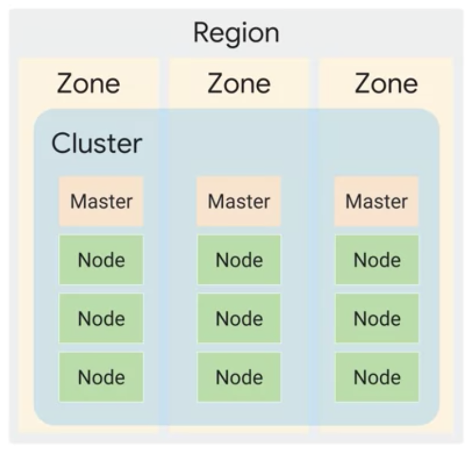

# Kubernetes Architechture notes

> Status : work in progress

* K8s objects (Apps)
    * Spec
    * Status
    * Resources
    * Kind (pods, container)
* Delcarative management of objects and state

---

## K8s Control plane <>

Fleet of cooperating process that monitors and manages the cluster. 

* Kube API server (Authorization requests, Kubectl commands processor)
* etcd (DB to store state of cluster)
* kube-scheduler (Decides where to run a pod)
* kube-controller-manager 
* kube-cloud-manager
* Kubelet - Agent on nodes
* kube-proxy

> Kubeadm (Opensource tool for setting up cluster)

---

## GKE

* Manages all control plane components.
* Provisions infra
* Maintains Node pools
* Allows users to configure and choose node spec 

### ZOnal cluster

### Regional cluster

