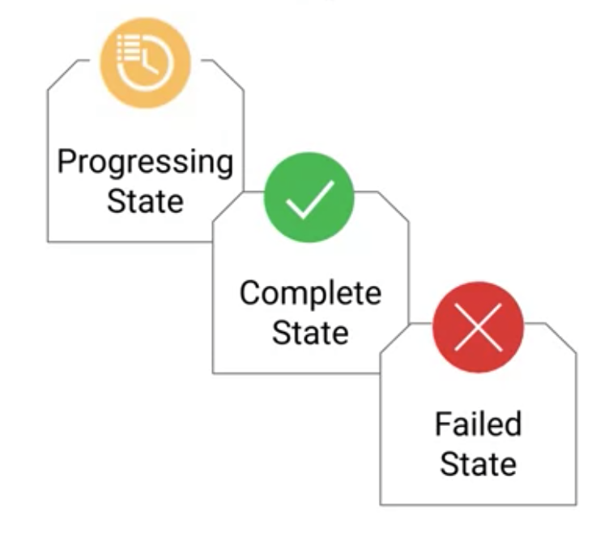

# Deployment and Jobs

## Deployment

"Deployment object" describes 
* Roll out updates
* Roll back to prev version
* Scale
* Describe desired state etc 
* tests
* health checks
* "Replica set" - ? 

"Deploment controller" component is responsible for keeping the desired state as per sepecificiton

### Deployment lifecycle states

### Methods to create deplopyment

* Deployment file (yaml file)
* Implicit command
* GKE menu on cloud console

