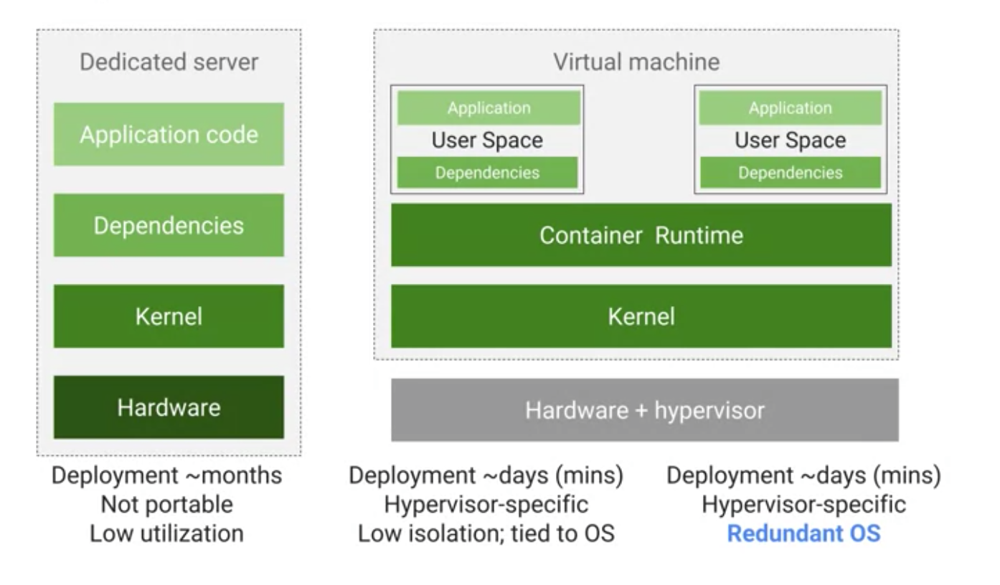
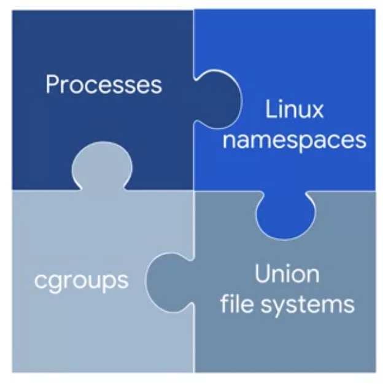
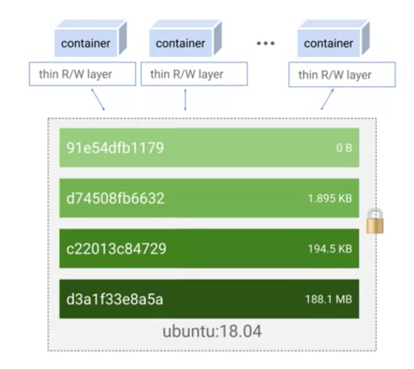

Containers and Kubernetes notes

> status : work in progress

* Apps used to be deployed on dedicated server

* Them came VMs and multiple apps were installed in VMs (dependencies, integration testing)

* Due to dependency and other resource crunches dedicated VM were started to be spun up for Apps

* Then came in Containers that overcomes many of the challenges and address many needs of modern software dev and deployment lifecycle

Containers are 
* light weight
* standalone
* portable
* delivery vehicles for app. 
* Next step in managing code

So many more advantages that appeal to developers

---

### Image

Lists a bunch of layers in a docker file

### Containers

Builds on tried and tested Linux tech
Processes
Linux namespaces
cgroups - cpu/mem/io/resources
File systems

### Docker 
Is the tech that runs those containers

> Best practices to build/package and run ?

> WHy is it fast to spin up and run containers ?

---

> Check out Cloud build service by google

