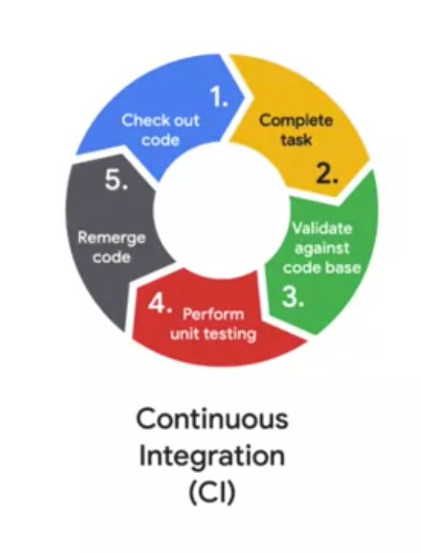
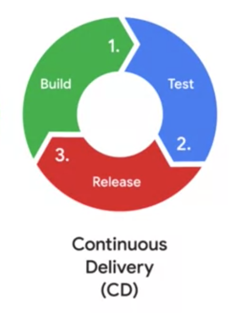
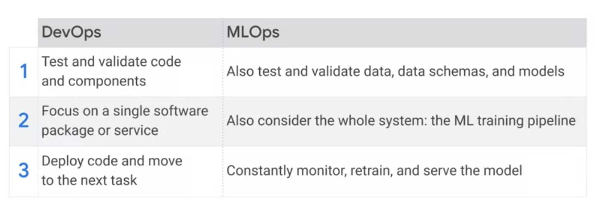
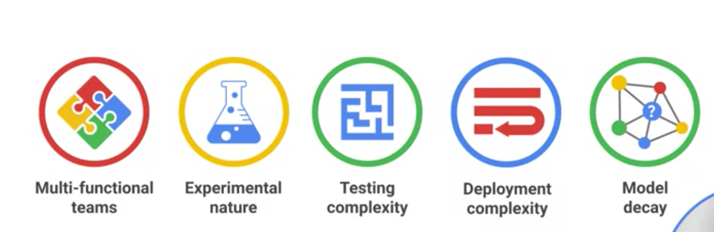
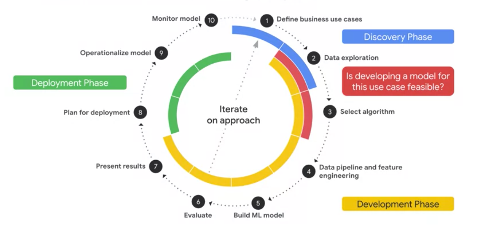
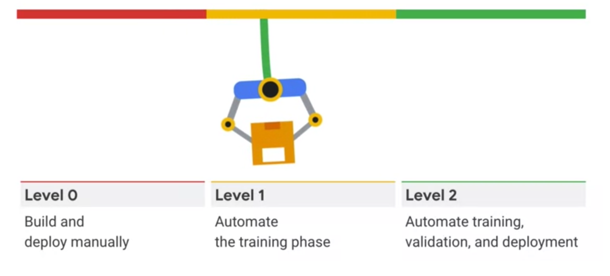

# MLOps
Notes from Coursera, MLOps (Machine Learning Operations) Fundamentals training.

> Status: Work in progress

## Challenges
Oprations perspective

Challengs faced from Data scientsts

Track models/versions of code/values of params/metrics

Need to pinpoint best model

Reproducibility major concern in production 

Update model and tracability 

## ML Lifecycle

1st step
Devops concepts > MLOps 

CI/CD in software world

Continous training is needed for ML

Difference between MLOps and DevOps

---

Has challenges of software dev + ML challenges due to its experimental nature and continously optimizing nature.

---

## ML phases 

Level of maturity - ML Automation

---

